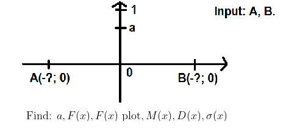
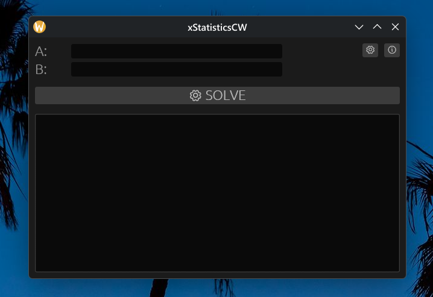

# Statistics Control Work (Rust Port)

**Project on the subject "Probability theory, probabilistic processes and mathematical statistics"**, 4th semester.

> ⚠️ **Using this repo you agree not to violate the rules of academic integrity.**
> Not for commercial use.

## 📖 About This Port

This project is a complete rewrite of my older [C# WPF application](https://github.com/xairaven/StatisticsCW). The original program was restricted to Windows and relied on outdated API wrapper libraries. I decided to port it to **Rust** to achieve true cross-platform compatibility (Windows, Linux, macOS) and to gain full control over the Wolfram Alpha API interactions without heavy third-party dependencies.

> [!NOTE]
> The core mathematical logic and the concept for this control work were written by me about 4 years ago. I simply update and fix it year by year for new streams of students. Because of its nature as a quick yearly utility, I didn't overcomplicate the architecture, so some parts of the codebase might be a bit "dirty" or straightforward.

## 🛠 Tech Stack & Patterns

- **Language:** Rust 🦀
- **GUI Framework:** [egui](https://github.com/emilk/egui) (Immediate mode GUI for seamless cross-platform rendering)
- **Async Runtime:** [tokio](https://tokio.rs/) (Handling heavy Wolfram Alpha API requests without freezing the UI)
- **Concurrency:** `crossbeam-channel` (Communication between the synchronous UI thread and the asynchronous backend)
- **HTTP Client:** `reqwest`
- **Report Generation:** Raw HTML generation with **MathJax** injected for flawless LaTeX rendering in the browser (completely eliminating the need to bundle heavy LaTeX engines, C++ wrappers, or PDF compilers in the binary).

### Key Architectural Patterns
- **Non-blocking UI:** The UI thread runs continuously. API calls are spawned in a separate native `std::thread` running a dedicated `tokio` runtime, sending results back to the UI via channels.
- **Smart API Fallbacks:** Wolfram Alpha returns highly dynamic JSONs. The client implements a strict priority-based fallback parser to reliably extract operands, handling edge cases where equations collapse into pure numbers (e.g., `0 where a = 1/10`).
- **Rate Limiting:** A `tokio::sync::Semaphore` is used to prevent spamming the Wolfram Alpha API and receiving HTTP 501 errors during equation solving.

## 📝 Task

## 🚀 How to install

1. Go to the [Releases](https://github.com/xairaven/xStatisticsCW/releases) page.
2. Download the executable file for your OS (Windows `.exe` or Linux/macOS binary).
3. Run the application.
4. 🎉

## 💡 How to use

The user interface is **intuitive**:

**Important:** You must register on the [Wolfram Alpha API Portal](https://products.wolframalpha.com/api/) and obtain your own `AppID`.
After obtaining it, open the **Settings** tab in the app and paste your `AppID` into the corresponding field.

## ⚙️ Requirements

### For use:
- Wolfram Alpha API `AppID`
- Any modern OS (Windows, Linux, macOS)
- A web browser (for viewing the generated HTML reports)

### For development:
- **Rust Toolchain** (`cargo`, `rustc`)

## 🤝 Contributions

**Contributions are welcome!** 🎉

It is highly recommended to create an issue with a description of your **bug/feature** before creating pull requests.

### About branching

This project uses the **TBD (Trunk-Based Development) git strategy**.

Each contributor should have their own branch.
**Naming example:** `feat/<nickname>`